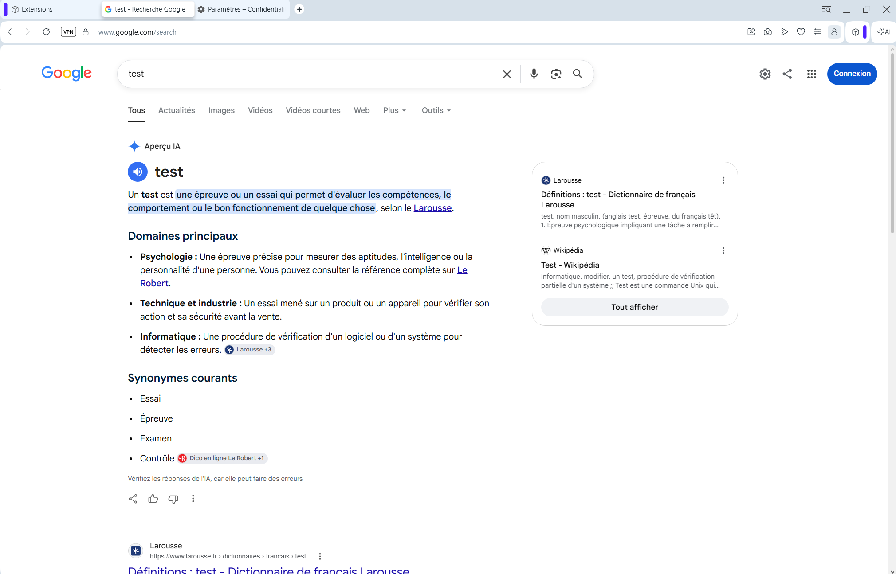

# AI Remover

**AI Remover** cleans up your Google search results by automatically removing **AI Overviews** (*Aperçu IA*) without breaking your navigation.

## Key Features

* **Seamless Browsing:** Hides AI Overviews dynamically while keeping access to Images, Videos, News, and other tabs intact.
* **Shadow DOM Support:** Uses smart DOM inspection to detect and collapse AI summary containers even when nested inside Google's custom components.
* **Real-Time Clean-up:** Monitors page changes with a `MutationObserver` so AI blocks disappear instantly without flickering.
* **Lightweight & Private:** No data tracking, no external server calls.

## Preview

| Before (Without Extension) | After (With AI Remover) |
| :---: | :---: |
|  |  |
